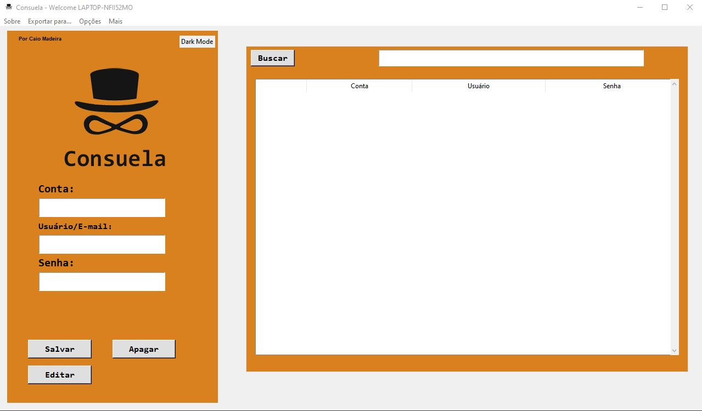
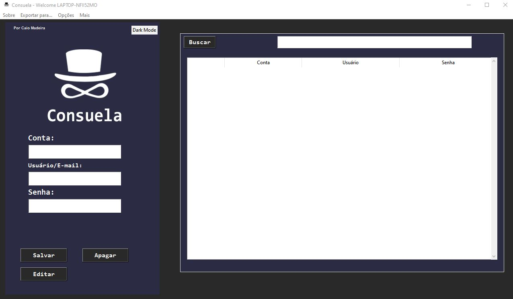
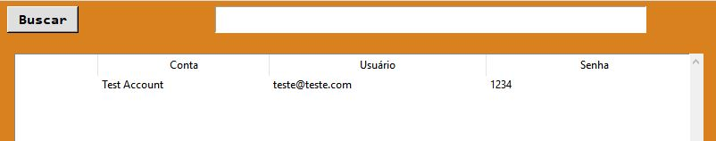
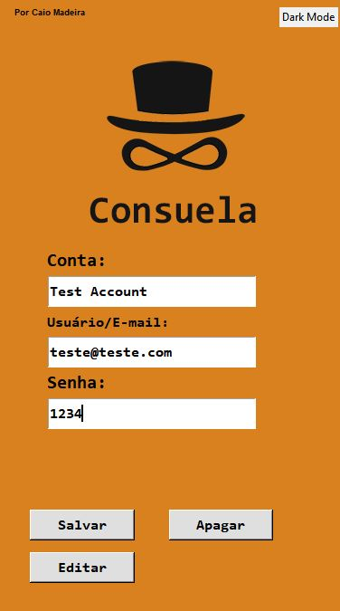
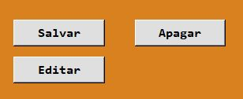
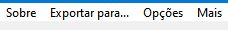

## &nbsp;&nbsp; ``Consuela - Your secrets with me``

  
Seus segredos comigo!

Um simples gerenciador de senhas para você manter seus dados centralizados e seguros.

> Para a versão em inglês do README.md, cheque os arquivos [README-ENG-USA.md](README-ENG-USA.md). 
>For an English version of README.md, check the [README-ENG-USA.md](README-ENG-USA.md).
-------
## &nbsp;&nbsp;&nbsp;&nbsp;&nbsp;&nbsp;&nbsp;&nbsp;&nbsp;&nbsp;&nbsp;&nbsp;&nbsp;&nbsp;&nbsp;&nbsp;&nbsp;&nbsp;&nbsp;&nbsp;&nbsp;&nbsp;&nbsp;&nbsp;  ``Sobre``

\* Versão: 1.0 *\

Consuela é um simples gerenciador de senha. Suas senhas são salvas localmente em um banco de dados em
/db/ usando a tecnologia SQLite 3.

 
Modo claro

 
Modo escuro

-------
## &nbsp;&nbsp;&nbsp;&nbsp;&nbsp;&nbsp;&nbsp;&nbsp;&nbsp;&nbsp;&nbsp;&nbsp;&nbsp;&nbsp;&nbsp;&nbsp;&nbsp;&nbsp;&nbsp;&nbsp;&nbsp;&nbsp;&nbsp;&nbsp;  ``Como usar``   

 
Usar é simples e bem intuitivo.  

**Salvar** - Salva as informações na lista  
**Editar** - Edita uma informação da lista  
**Apagar** - Apaga uma informação da lista  

 

 

___
Você pode exportar em pdf!

 

